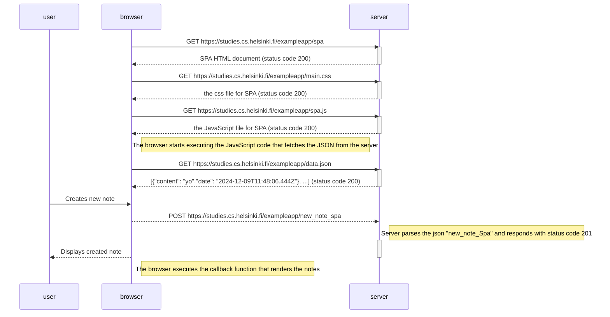

```mermaid

sequenceDiagram
    participant user
    participant browser
    participant server

    browser->>server: GET https://studies.cs.helsinki.fi/exampleapp/spa
    activate server
    server-->>browser: SPA HTML document (status code 200)
    deactivate server

    browser->>server: GET https://studies.cs.helsinki.fi/exampleapp/main.css
    activate server
    server-->>browser: the css file for SPA (status code 200)
    deactivate server

    browser->>server: GET https://studies.cs.helsinki.fi/exampleapp/spa.js
    activate server
    server-->>browser: the JavaScript file for SPA (status code 200)
    deactivate server

    Note right of browser: The browser starts executing the JavaScript code that fetches the JSON from the server

    browser->>server: GET https://studies.cs.helsinki.fi/exampleapp/data.json
    activate server
    server-->>browser: [{"content": "yo","date": "2024-12-09T11:48:06.444Z"}, ...] (status code 200)
    deactivate server

    user->>browser: Creates new note
    browser-->>server: POST https://studies.cs.helsinki.fi/exampleapp/new_note_spa
    Note right of server: Server parses the json "new_note_Spa" and responds with status code 201
    activate server
    browser-->>user: Displays created note
    deactivate server
    

    Note right of browser: The browser executes the callback function that renders the notes
```